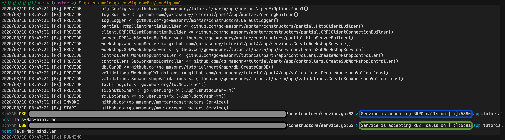
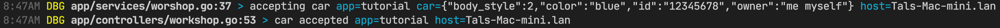

# Tutorial - Part 4 Instrumentation

Like you probably noticed Mortar is heavily based on Fx and introduces some Interfaces.
Until now, we haven't "created" any dependency yet. What we did was to assume everything will work (and it will).
Now let's create all the dependencies and wire everything together.

## main.go

Like any other program our tutorial must have a `main.go` file.

```golang
func main() {
  ...
   app := createApplication(CLI.Config.Path, CLI.Config.AdditionalFiles)
   app.Run()
  ...
}

func createApplication(configFilePath string, additionalFiles []string) *fx.App {
 return fx.New(
  mortar.ViperFxOption(configFilePath, additionalFiles...), // Configuration map
  mortar.LoggerFxOption(),                                  // Logger
  ...
 )
}
```

As you can see in the above code `fx.New` accepts different options. This way you tell Fx how it should build your dependency graph.

## Dependencies and Constructors

Now, before we continue with the explanations I just want to remind you (yes you should get yourself familiar with Fx) that we need to tell Fx how to build our dependency graph.
Since GO lacks meta programming we will need to do it explicitly. Do note that Mortar provides a lot of predefined `fx.Option`s, more about them later.

To create a Dependency we need to have a function where it's return type is the Dependency. For example, here is a function that creates our Workshop Controller.

```func CreateWorkshopController(deps workshopControllerDeps) WorkshopController```

You can think of them as **[Constructors](https://en.wikipedia.org/wiki/Constructor_(object-oriented_programming))**. Fx have two options that accept constructors, `fx.Provide` and `fx.Invoke`.
The former will call your constructor only if it's dependency is needed by another constructor while the later will **Eagerly** create the entire graph needed by the Invoked constructor.

## Configuration

As mentioned before, you need to import/build an Implementation for Mortar, in this Tutorial we are going to use [Viper](https://github.com/spf13/viper) for `Config`.
We already *bricked* [it](https://github.com/go-masonry/bviper).

To build a configuration map we are going to use `config/config.yml` file in our tutorial. This file is going to be read by Viper.
To read more about the configuration read [here](https://github.com/go-masonry/mortar/blob/master/wiki/config.md).

To use/configure it's predefined logic, Mortar expects a dedicated Configuration map under a Key called **mortar**

```yaml
mortar:
  name: "tutorial"
  ...
```

## Wiring

### Viper

If you noticed we had an empty directory `app/mortar` that we are now going to fill with code.

Let's look at `app/mortar/config.go` file

```golang
package mortar

import (
  "github.com/go-masonry/bviper"
  "github.com/go-masonry/mortar/interfaces/cfg"
  "go.uber.org/fx"
)

func ViperFxOption(configFilePath string, additionalFilePaths ...string) fx.Option {
  return fx.Provide(func() (cfg.Config, error) {
    builder := bviper.Builder().SetConfigFile(configFilePath)
    for _, extraFile := range additionalFilePaths {
      builder = builder.AddExtraConfigFile(extraFile)
    }
    return builder.Build()
  })
}
```

Remember your code is not the one calling the Constructors, Fx does it for you. Hence we can't tell it to provide custom parameters. But we can wrap this with a [Closure](https://en.wikipedia.org/wiki/Closure_(computer_programming)). This way we have a Constructor `func() (cfg.Config, error)` that accepts no parameter and can be safely called by Fx.

### Logger

By now you got the idea, Mortar have a `Logger` interface and we will use [Zerolog](https://github.com/rs/zerolog) to implement it using [bzerolog](https://github.com/go-masonry/bzerolog) Brick.

```golang
import "github.com/go-masonry/bzerolog

func LoggerFxOption() fx.Option {
  return fx.Options(
    fx.Provide(zeroLogBuilder),
    providers.LoggerFxOption(),
  )
}

func zeroLogBuilder(config cfg.Config) log.Builder {
 builder := bzerolog.Builder().IncludeCaller()
 if config.Get(mortar.LoggerWriterConsole).Bool() {
  builder = builder.SetWriter(bzerolog.ConsoleWriter(os.Stderr))
 }
 return builder
}
```

If you look at this Constructor function

`func ZeroLogBuilder(config cfg.Config) log.Builder`

You see that it depends on `Config` which we provided earlier.
This is how we tell Fx that in order to build `log.Builder` it needs to provide `Config` first.
However this Constructor function doesn't produce `Logger` instead it produces something called `log.Builder` which will later be used by Mortar to configure it's Default `Logger`.

This is why if you look above the Constructor function there is this line `providers.LoggerFxOption()`. This option depends on the `log.Builder` and will provide us with the Logger.
Here is how it's defined within Mortar.

```golang
// LoggerFxOption adds Default Logger to the graph
func LoggerFxOption() fx.Option {
  return fx.Provide(constructors.DefaultLogger)
}
```

### WebService

After all we are building a Web Service with gRPC and REST. It is time to introduce how one should configure Mortar Web Service.
To remind you, we are going to use [go-grpc](https://grpc.io/docs/languages/go/basics/) and [grpc-gateway](https://grpc-ecosystem.github.io/grpc-gateway) to implement Http Web Service.

If look at [grpc-server-example](https://github.com/grpc/grpc-go/blob/master/examples/route_guide/server/server.go) example. Especially `func main()`, you can see how one can create and start a simple gRPC service.

You can also look at [grpc-gateway-example](https://grpc-ecosystem.github.io/grpc-gateway/docs/usage.html) example. **Section 6** there is also an example of how to create and start grpc-gateway service.

One of Mortar goals is to reduce boilerplate code. However, we also want you to be able to control how to configure Mortar's web services.
Meaning you can configure both `grpc-server` and `grpc-gateway` the way you need it. But, we have some defaults which are good for most cases.

To create Mortar web service you need to provide Fx with at least these options

1. Web Server Builder `providers.HTTPServerBuilderFxOption()`
2. Invoke everything related to Web server `providers.BuildMortarWebServiceFxOption()`
  
First option creates a Web Server Builder using **implicitly** provided configuration. Second one uses this Builder to create a Web Service and all it's dependencies while also adding `fx.Lifecycle` OnStart/OnStop hooks. Once we run our application, OnStart `fx.Lifecycle` hooks will be run and start our service.

But creating Web Service is not enough, we need also to create our Workshop and SubWorkshop Implementations. Let's look at our `main.go` again.

```golang
func createApplication(configFilePath string, additionalFiles []string) *fx.App {
 return fx.New(
  mortar.ViperFxOption(configFilePath, additionalFiles...), // Configuration map
  mortar.LoggerFxOption(),                                  // Logger
  mortar.HttpClientFxOptions(),
  mortar.HttpServerFxOptions(),
  // This one invokes all the above
  providers.BuildMortarWebServiceFxOption(), // http server invoker
 )
}
```

You can see that we added 4 new dependencies to our graph. Well actually that's not true, there are several dependencies hiding behind these options.

### Registering Tutorial's API

Although we created everything, actually nothing will work. That's because we haven't yet told gRPC Server what implements our API. Or even what that API is.
This is also true for grpc-gateway configuration. We haven't registered any handlers to act as reverse-proxy for our gRPC API.

For gRPC API first we need to provide at least one function that satisfies this [type](https://github.com/go-masonry/mortar/blob/master/interfaces/http/server/interfaces.go#L39).

```golang
type GRPCServerAPI func(server *grpc.Server)
```

Like [this](app/mortar/tutorial.go)

```golang
func tutorialGRPCServiceAPIs(deps tutorialServiceDeps) serverInt.GRPCServerAPI {
  return func(srv *grpc.Server) {
    workshop.RegisterWorkshopServer(srv, deps.Workshop)
    workshop.RegisterSubWorkshopServer(srv, deps.SubWorkshop)
  }
}
```

and group all of them under `fx.Group` named **"grpcServerAPIs"** or even better use a predefined const alias `groups.GRPCServerAPIs`.

```golang
// GRPC Service APIs registration
fx.Provide(fx.Annotated{
  Group:  groups.GRPCServerAPIs,
  Target: tutorialGRPCServiceAPIs,
})
```

For GRPC-Gateway reverse-proxy handlers we need to satisfy [this](https://github.com/go-masonry/mortar/blob/master/interfaces/http/server/interfaces.go#L55)

```golang
type GRPCGatewayGeneratedHandlers func(mux *runtime.ServeMux, endpoint string) error
```

Like [this](app/mortar/tutorial.go)

```golang
func tutorialGRPCGatewayHandlers() []serverInt.GRPCGatewayGeneratedHandlers {
  return []serverInt.GRPCGatewayGeneratedHandlers{
    // Register workshop REST API
    func(mux *runtime.ServeMux, endpoint string) error {
      return workshop.RegisterWorkshopHandlerFromEndpoint(context.Background(), mux, endpoint, []grpc.DialOption{grpc.WithInsecure()})
    },
    // Register sub workshop REST API
    func(mux *runtime.ServeMux, endpoint string) error {
      return workshop.RegisterSubWorkshopHandlerFromEndpoint(context.Background(), mux, endpoint, []grpc.DialOption{grpc.WithInsecure()})
    },
    // Any additional gRPC gateway registrations should be called here
  }
}
```

and group all of them under `fx.Group` named **"grpcGatewayGeneratedHandlers"** or even better use predefined const alias `groups.GRPCGatewayGeneratedHandlers`.

```golang
// GRPC Gateway Generated Handlers registration
fx.Provide(fx.Annotated{
  Group:  groups.GRPCGatewayGeneratedHandlers + ",flatten", // "flatten" does this [][]serverInt.GRPCGatewayGeneratedHandlers -> []serverInt.GRPCGatewayGeneratedHandlers
  Target: tutorialGRPCGatewayHandlers,
})
```

> Pay special attention for the **",flatten"** suffix

### Run it

Finally we have a working Workshop and even a SubWorkshop.

If you look at the `config/config.yml` file you will find 3 ports there.

- gRPC `mortar.server.grpc.port` **5380**
- Public REST `mortar.server.rest.external.port` **5381**
- Private REST `mortar.server.rest.internal.port` **5382** later on this one.

Let's run our service, you should adjust your imports accordingly

```shell script
go run main.go config config/config.yml
```

You should see something similar to this



Now you can test your service using gRPC or REST clients, I use [HTTPie](https://httpie.org/).

- Workshop should accept a new car
  
  ```s
  POST /v1/workshop/cars HTTP/1.1
  Accept: application/json, */*;q=0.5
  Accept-Encoding: gzip, deflate
  Connection: keep-alive
  Content-Length: 84
  Content-Type: application/json
  Host: localhost:5381
  User-Agent: HTTPie/2.2.0

  {
      "body_style": "HATCHBACK",
      "color": "blue",
      "id": "12345678",
      "owner": "me myself"
  }

  HTTP/1.1 200 OK
  Content-Length: 2
  Content-Type: application/json
  Date: Mon, 10 Aug 2020 05:47:44 GMT
  Grpc-Metadata-Content-Type: application/grpc

  {}
  ```

- You should see some logs that we added previously

  

- Stop the service with `Ctrl+C`
  