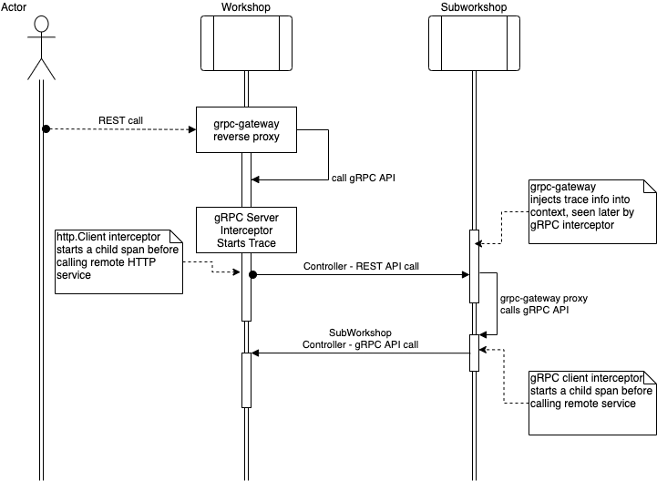
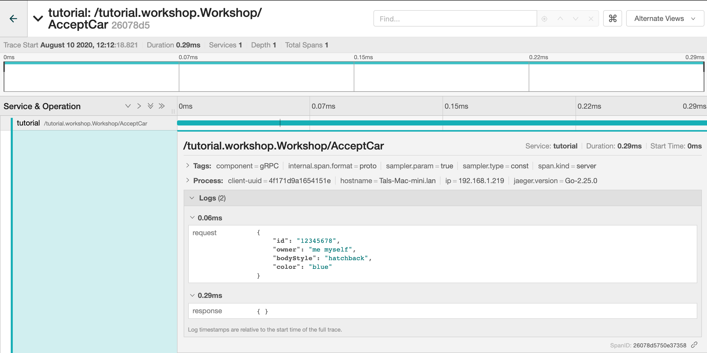
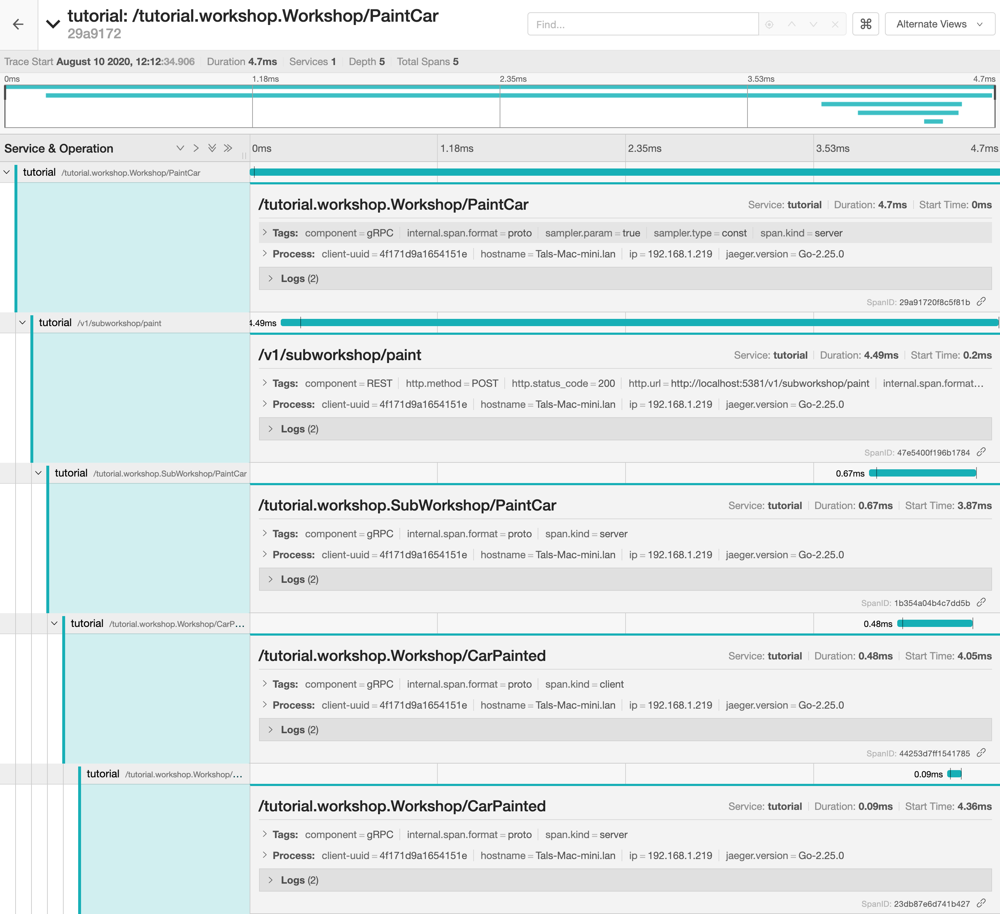
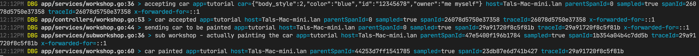

# Tutorial - Part 5 Middleware

In this part you will see how you can add a lot of implicit logic without actually changing your business logic.

## Internal Handlers

When your service is running in a cloud it is sometimes very convenient to understand how it was configured, last git commit, memory, run flags, profiling, etc.

To add all of these goodies you need to provide Fx some predefined Mortar options, found under the [providers](https://github.com/go-masonry/mortar/tree/master/providers) directory in Mortar project.

In this tutorial we have added them into a single function within [`mortar/http.go`](app/mortar/http.go) file and [`main.go`](main.go) respectively.

```golang
// These will help you to debug/profile or understand the internals of your service
func InternalHttpHandlersFxOptions() fx.Option {
  return fx.Options(
    providers.InternalDebugHandlersFxOption(),
    providers.InternalProfileHandlerFunctionsFxOption(),
    providers.InternalSelfHandlersFxOption(),
  )
}
```

>Once added you can access them on the internal REST port **5382**.

Here is what you get by adding the above options.

### Self configuration, build info

- <http://localhost:5382/self/config> Exposes your Configuration map with Environment Variables. Where you can obfuscate values if it holds sensitive information like Passwords, Tokens, etc.
  
  ```json
  {
    "config": {
        "custom": {
            "authentication": "****",
            "plain": "text",
            "secretmap": {
                "one": "****",
                "two": "****"
            },
            "token": "very****oken"
        },
        "mortar": {
            "handlers": {
                "self": {
                    "obfuscate": "[pass auth secret login user logname token]"
                }
            },
            "logger": {
                "console": "true",
                "level": "debug"
            },
        },
        ...
    },
   "environment": {
        "COLORTERM": "truecolor",
        "GIT_ASKPASS": "/App****s.sh",
        ...
   }
  }
  ```

- <http://localhost:5382/self/build> Exposes your build information. For this to work you will need to inject values during build, more on that [here](#part-7-makefile-and-ldflags).

  ```json
  {
    "build_tag": "wasn't provided during build",
    "build_time": "0001-01-01T00:00:00Z",
    "git_commit": "wasn't provided during build",
    "hostname": "Tals-Mac-mini.lan",
    "init_time": "2020-08-13T13:27:28.946576+03:00",
    "up_time": "11.987839422s",
    "version": "wasn't provided during build"
  }
  ```

### Debug, pprof, heap dump, stats

- <http://localhost:5382/internal/debug/pprof> package `pprof` with a different prefix `:[PORT]/internal/`.
  More can be read [here](https://golang.org/pkg/net/http/pprof/).
- <http://localhost:5382/internal/debug/vars> package [expvar](https://golang.org/pkg/expvar/).
- <http://localhost:5382/internal/dump> heap dump.
- <http://localhost:5382/internal/stats> memory, cpu, go-routines.

## Telemetry

Read [OpenTelemetry](https://opentelemetry.io/about/) definitions to understand better, here is a snippet...

> What is Observability?
>
> In software, observability typically refers to telemetry produced by services and is often divided into three major verticals:
>
> [Tracing](https://opentracing.io/docs/overview/what-is-tracing), aka distributed tracing, provides insight into the full lifecycles, aka traces, of requests to the system, allowing you to pinpoint failures and performance issues.
>
> [Metrics](https://opencensus.io/stats) provide quantitative information about processes running inside the system, including counters, gauges, and histograms.
>
> [Logging](https://en.wikipedia.org/wiki/Log_file) provides insight into application-specific messages emitted by processes.
>
> These verticals are tightly interconnected. Metrics can be used to pinpoint, for example, a subset of misbehaving traces. Logs associated with those traces could help to find the root cause of this behavior. And then new metrics can be configured, based on this discovery, to catch this issue earlier next time. Other verticals exist (continuous profiling, production debugging, etc.), however traces, metrics, and logs are the three most well adopted across the industry.

### Tracing

_If you want to try this part yourself, make sure you have access to Jaeger service._

> Since SubWorkshop is part of this service and is served by a different API serves us in this example.

When someone calls our `Paint Car` API

```s
PUT /v1/workshop/cars/12345678/paint HTTP/1.1
Accept: application/json, */*;q=0.5
Accept-Encoding: gzip, deflate
Connection: keep-alive
Content-Length: 25
Content-Type: application/json
Host: localhost:5381
User-Agent: HTTPie/2.2.0

{
    "desired_color": "cyan"
}
```

This is what actually happens on our service.



1. **Workshop** REST API layer accepts the call.
   - **Workshop** gRPC API is called via reverse-proxy, we use grpc-gateway.
2. **Workshop** Business logic is then calls the SubWorkshop service, using REST client.
3. **SubWorkshop** REST API layer accepts the call.
   - **SubWorkshop** gRPC API is called via reverse-proxy.
4. **SubWorkshop** Business logic calls back the Workshop, using gRPC client.
5. **Workshop** gRPC API accepts the call.

>Here SubWorkshop is on the same service, but since we are calling it remotely, it simulates a distant service.

To better understand what happens on our service we want to enable [distributed-tracing](https://opentracing.io/docs/overview/what-is-tracing/)

Again, all one needs to do is provide some `fx.Option`s to our graph.
If you look at the `mortar/http.go` file you will see that we added new options to Clients and Server.

- `providers.TracerGRPCClientInterceptorFxOption()` adds tracing information when any gRPC method is called on the gRPC client.
- `providers.TracerRESTClientInterceptorFxOption()` same for REST client.
- `providers.GRPCTracingUnaryServerInterceptorFxOption()` adds tracing information and starts a span on every incoming gRPC call.
- `providers.GRPCGatewayMetadataTraceCarrierFxOption()` maps tracing information if it exists within the Request headers, avoids creating new span just to for REST-gRPC mapping.

We also need to instrument a tracer implementation, in our case [bjaeger](https://github.com/go-masonry/bjaeger). Look at `mortar/tracing.go` and `main.go` respectively.

> If you want to test this yourself, you will need to create 3 environment variables for Jaeger client.
>
> - `JAEGER_SAMPLER_TYPE=const`
> - `JAEGER_SAMPLER_PARAM=1`
> - `JAEGER_AGENT_HOST="192.168.99.100"` change this to your Jaeger IP.

Here is what this looks like in the Jaeger UI

- Accepting a Car
  
- Painting a Car
  

That's not all, remember our logs from before ? They can also be enriched with Tracing information.

> When you add tracing info to the logs, you can aggregate all the logs related to a single trace!

To enrich logs with trace info we added a `log.ContextExtractor` function.
This function is defined within the `bviper` wrapper since only it can access `jaeger.SpanContext`.

If you look at the `mortar/logger.go` file you can see that we added a new option to the Zerolog builder.

```golang
bjaeger.TraceInfoContextExtractorFxOption()
```

There you go



### Monitoring

In order to provide quantitative information about processes running inside the system, you need to add some... Options.

Basically there are 2 ways to provide that information to remote services

- `statsd`/`datadog` where you push each metric to the agent.
- `prometheus` where the service exposes an http endpoint which is later queried by Prometheus periodically.
  
In this tutorial we are using [Prometheus](https://prometheus.io/), but you don't need to run it to see some results.

Have a look at [`metrics.go`](app/mortar/metrics.go) you will see several options there.
Similar to the Logger we covered previously we have a builder which is later used by mortar to create Metrics interface.
This interface `monitor.Metrics` allows you to create different metrics.
Mortar have an internal cache for metrics, this way you can "ask" for the same metric without creating it.

Prometheus consists of 2 parts

- Client that have an internal registry and holds all the counter/gauge/histogram values.
- HTTP handler which is periodically called by Prometheus server to get updated metrics.

Prometheus HTTP handler is exposed on the internal port <http://localhost:5382/metrics> you can change it if needed.
We also registered gRPC server interceptor that measures every gRPC call duration.

If run this example and call <http://localhost:5382/metrics> you should see something similar to this

```shell
...
# HELP tutorial_grpc_AcceptCar time api calls for /tutorial.workshop.Workshop/AcceptCar
# TYPE tutorial_grpc_AcceptCar histogram
tutorial_grpc_AcceptCar_bucket{code="0",tag1="value",tag2="value",tag3="value",le="0.005"} 2
tutorial_grpc_AcceptCar_bucket{code="0",tag1="value",tag2="value",tag3="value",le="0.01"} 2
tutorial_grpc_AcceptCar_bucket{code="0",tag1="value",tag2="value",tag3="value",le="0.025"} 2
tutorial_grpc_AcceptCar_bucket{code="0",tag1="value",tag2="value",tag3="value",le="0.05"} 2
tutorial_grpc_AcceptCar_bucket{code="0",tag1="value",tag2="value",tag3="value",le="0.1"} 2
tutorial_grpc_AcceptCar_bucket{code="0",tag1="value",tag2="value",tag3="value",le="0.25"} 2
tutorial_grpc_AcceptCar_bucket{code="0",tag1="value",tag2="value",tag3="value",le="0.5"} 2
tutorial_grpc_AcceptCar_bucket{code="0",tag1="value",tag2="value",tag3="value",le="1"} 2
tutorial_grpc_AcceptCar_bucket{code="0",tag1="value",tag2="value",tag3="value",le="2.5"} 2
tutorial_grpc_AcceptCar_bucket{code="0",tag1="value",tag2="value",tag3="value",le="5"} 2
tutorial_grpc_AcceptCar_bucket{code="0",tag1="value",tag2="value",tag3="value",le="10"} 2
tutorial_grpc_AcceptCar_bucket{code="0",tag1="value",tag2="value",tag3="value",le="+Inf"} 2
tutorial_grpc_AcceptCar_sum{code="0",tag1="value",tag2="value",tag3="value"} 0.0007157299999999999
tutorial_grpc_AcceptCar_count{code="0",tag1="value",tag2="value",tag3="value"} 2
...
...
```