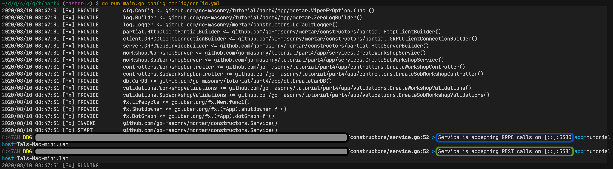
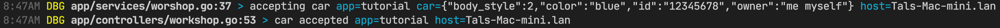
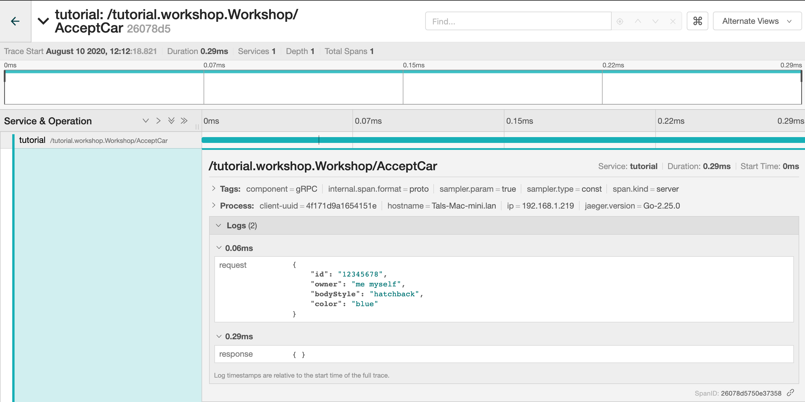
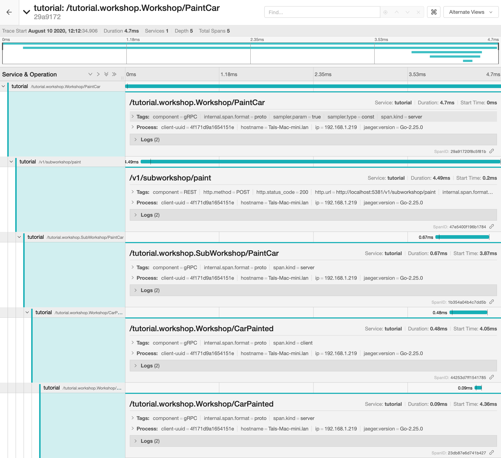
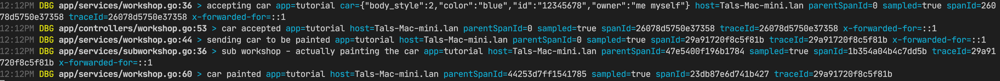

# Tutorial

This tutorial will explain how to build a gRPC web service using [go-masonry/mortar](https://github.com/go-masonry/mortar) step by step.

- [Tutorial](#tutorial)
  - [Prerequisites](#prerequisites)
  - [Part 1 API](#part-1-api)
    - [Workshop](#workshop)
    - [gRPC](#grpc)
    - [Adding REST](#adding-rest)
    - [SubWorkshop](#subworkshop)
    - [Generating code from our proto file](#generating-code-from-our-proto-file)
  - [Part 2 Implementing](#part-2-implementing)
    - [Project Structure](#project-structure)
    - [Building Workshop](#building-workshop)
      - [Services](#services)
      - [Validations](#validations)
      - [Controllers](#controllers)
      - [Fake DB](#fake-db)
    - [Building SubWorkshop](#building-subworkshop)
  - [Part 3 Uber-Fx](#part-3-uber-fx)
    - [Dependency Injection](#dependency-injection)
    - [Introducing Mortar and Bricks](#introducing-mortar-and-bricks)
    - [Back to code](#back-to-code)
  - [Part 4 Instrumentation](#part-4-instrumentation)
    - [main.go](#maingo)
    - [Dependencies and Constructors](#dependencies-and-constructors)
    - [Configuration](#configuration)
    - [Logger](#logger)
    - [Wiring WebService](#wiring-webservice)
    - [GRPC and GRPC-Gateway](#grpc-and-grpc-gateway)
    - [Run it](#run-it)
  - [Part 5 Middleware](#part-5-middleware)
    - [Debug, profile, configuration](#debug-profile-configuration)
    - [Tracing](#tracing)
  - [Part 6 Tests](#part-6-tests)
    - [Overriding Configuration values in Tests](#overriding-configuration-values-in-tests)
    - [Fake REST API calls](#fake-rest-api-calls)
    - [Fake gRPC API calls](#fake-grpc-api-calls)
  - [Makefile and LDFLAGS](#makefile-and-ldflags)

## Prerequisites

- You should be familiar with [Protobuf](https://developers.google.com/protocol-buffers), [gRPC](https://grpc.io) and [REST](https://en.wikipedia.org/wiki/Representational_state_transfer) / [Swagger](https://en.wikipedia.org/wiki/OpenAPI_Specification)
  - Install everything related to `gRPC` starting [here](https://developers.google.com/protocol-buffers/docs/gotutorial)
- You should understand what [Dependency Injection](https://en.wikipedia.org/wiki/Dependency_injection) is
- *Optional* Have access to [Jaeger](https://www.jaegertracing.io/docs/1.18/getting-started) service

## Part 1 API

### Workshop

In this tutorial we are going to build a Workshop (Garage) web service. Our Workshop specializes in painting cars.
In order to paint a car first it needs to be *accepted* in our Workshop. Once accepted we can *paint* it.
Once painted the customer can *collect* it.

Given all the above we should expose these Endpoints:

- Accept Car
- Paint Car
- Retrieve Car

### gRPC

We will use protobuf to describe this service

```protobuf
service Workshop {
  rpc AcceptCar(Car) returns (google.protobuf.Empty);
  rpc PaintCar(PaintCarRequest) returns (google.protobuf.Empty);
  rpc RetrieveCar(RetrieveCarRequest) returns (Car);
}
```

Our service will expose a gRPC API based on the above protobuf definition.

### Adding REST

While gRPC is great, REST API however is still heavily used. If you look above, our service will have a gRPC implementation of the above API, why not reuse it ?
Well why not? To help us achieve this we will use [grpc-gateway](https://github.com/grpc-ecosystem/grpc-gateway) which will create a REST API reverse-proxy layer on top of our gRPC API.
If you are not familiar with it please read about it, it's an **amazing project**.

REST API still needs to be defined and grpc-gateway supports [1](https://grpc-ecosystem.github.io/grpc-gateway/docs/usage.html), [2](https://grpc-ecosystem.github.io/grpc-gateway/docs/grpcapiconfiguration.html) ways of doing it.
Since we own our proto files we can "enrich" them, hence we are going to use option 1. Let's go ahead and add custom options to our proto files.
  
```protobuf
import "google/api/annotations.proto";
service Workshop {
  rpc AcceptCar(Car) returns (google.protobuf.Empty){
    option (google.api.http) = {
      post: "/v1/workshop/cars"
      body: "*"
    };
  }

  rpc PaintCar(PaintCarRequest) returns (google.protobuf.Empty) {
    option (google.api.http) = {
      put: "/v1/workshop/cars/{car_number}/paint"
      body: "*"
    };
  }

  rpc RetrieveCar(RetrieveCarRequest) returns (Car) {
    option (google.api.http) = {
      get: "/v1/workshop/cars/{car_number}"
    };
  }
}
```

grpc-gateway protoc plugin will use provided `(google.api.http)` options to generate our reverse-proxy REST layer.

### SubWorkshop

**Plot twist**, our Workshop is not going to do the actual painting but will delegate this task to another Workshop a.k.a SubWorkshop.
SubWorkshop will expose only one Endpoint:

- Paint Car

Once our SubWorkshop paints the car it returns it to main Workshop. Since we want to show different features here (later on that), we will add an additional RPC to our Workshop. This new endpoint will only going to be exposed via gRPC.

```protobuf
service Workshop {
  ....
  rpc CarPainted(PaintFinishedRequest) returns (google.protobuf.Empty);
}
```

**In this tutorial our service will implement both APIs.**

To define SubWorkshop API we will use protobuf again to describe it

```protobuf
service SubWorkshop{
  rpc PaintCar(SubPaintCarRequest) returns (google.protobuf.Empty) {
    option (google.api.http) = {
      post: "/v1/subworkshop/paint"
      body: "*"
    };
  }
}
```

### Generating code from our proto file

If you haven't installed grpc-gateway plugin by now, please do.

To generate our code we will run the following command from within the `tutorial/api` directory

```s
protoc  -I. \
  -I$GOPATH/src \
  -I$GOPATH/src/github.com/grpc-ecosystem/grpc-gateway/third_party/googleapis \
  --grpc-gateway_out=:. \
  --swagger_out=:. \
  --go_out=plugins=grpc:. \
  garage.proto
```

You can find all the generated files [here](complete/api).

## Part 2 Implementing

### Project Structure

This tutorial proposes a project structure.
Having a consistent project structure helps a lot, however you can create your own, if needed.
What's more important is that your services project structure should look as similar as possible.
This helps a lot when there are different projects/groups and handful of developers.

Let's make a brief overview

```s
.
├── api
├── app
│   ├── controllers
│   ├── data
│   ├── mortar
│   ├── services
│   └── validations
├── build
├── config
└── tests
```

- `api` directory will store this service API definitions.
- `app` holds our service code.
  - `services` implements our gRPC API interfaces, also an entry point. Code here accepts all the input first.
  - `validations` treat everything related to validating input.
  - `data` everything related to storing data.
  - `controllers` business logic lays here.
  - `mortar` later on this one.
- `build` you will need to build your service (CI/CD).
- `config` all configuration files should be here.
- `tests` functional/integration tests.
  
### Building Workshop

In this part we will build the following

- [Services](#services)
- [Validations](#validations)
- [Controllers](#controllers)
- [DB](#fake-db)

#### Services

Every input starts with `service`, once we get an input we want to `validate` it. Once validated we will call a `controller` to do the actual business logic. For the sake of brevity we will show only one Function

```golang
type workshopImpl struct {
  deps workshopServiceDeps
}

func CreateWorkshopService(deps workshopServiceDeps) workshop.WorkshopServer {
  return &workshopImpl{deps: deps}
}

func (w *workshopImpl) AcceptCar(ctx context.Context, car *workshop.Car) (*empty.Empty, error) {
  if err := w.deps.Validations.AcceptCar(ctx, car); err != nil {
    return nil, err
  }
  return w.deps.Controller.AcceptCar(ctx, car)
}
```

As you can see I wasn't lying, we first `validate` then use the logic in the `controller` to treat this request.

So far nothing special, but you probably (or not) noticed an undefined struct called `workshopServiceDeps`. Here it is

```golang
type workshopServiceDeps struct {
  Controller  controllers.WorkshopController
  Validations validations.WorkshopValidations
}
```

#### Validations

To simplify how we call our dependencies (validations, controllers) we defined Validation Interface to match our Service API. The only difference is that Validations functions return just an `error`.

```golang
type WorkshopValidations interface {
  AcceptCar(ctx context.Context, car *workshop.Car) error
  PaintCar(ctx context.Context, request *workshop.PaintCarRequest) error
  RetrieveCar(ctx context.Context, request *workshop.RetrieveCarRequest) error
  CarPainted(ctx context.Context, request *workshop.PaintFinishedRequest) error
}
```

#### Controllers

Since Controller will implement the same exact gRPC API we can simply embed it.

```golang
type WorkshopController interface {
  workshop.WorkshopServer
}
```

Please remember that we also have a SubWorkshop service. Our business logic should call this SubWorkshop to actually paint the car, given the car was previously accepted by the Workshop. In this example we will use `*http.Client` a.k.a REST Client to call SubWorkshop API.

```golang
type workshopController struct {
  deps    workshopControllerDeps // try to guess what we have here
  client  *http.Client
}

func (w *workshopController) PaintCar(ctx context.Context, request *workshop.PaintCarRequest) (*empty.Empty, error) {
  car, err := w.deps.DB.GetCar(ctx, request.GetCarNumber())
  if err != nil {
    return nil, err
  }
  httpReq, err := w.makePaintRestRequest(ctx, car, request)
  if err != nil {
    return nil, err
  }
  response, err := w.client.Do(httpReq)
  if err != nil {
    return nil, err
  }
  defer response.Body.Close()
  if response.StatusCode != http.StatusOK {
    return nil, fmt.Errorf("painting failed with status %d", response.StatusCode)
  }
  return &empty.Empty{}, nil
}
```

#### Fake DB

Once our Workshop accepts a car it needs to store it somewhere. We will fake a DB by using a simple MAP `map[string]*CarEntity`

```golang
type CarEntity struct {
  CarNumber     string
  Owner         string
  BodyStyle     string
  OriginalColor string
  CurrentColor  string
  Painted       bool
}

type CarDB interface {
  InsertCar(ctx context.Context, car *CarEntity) error
  PaintCar(ctx context.Context, CarNumber string, newColor string) error
  GetCar(ctx context.Context, CarNumber string) (*CarEntity, error)
  RemoveCar(ctx context.Context, CarNumber string) (*CarEntity, error)
}
```

> As a practice don't use your external DTOs as your DB models/Entities.

If you want to understand how everything should work, please take a look at the code within this directory.

### Building SubWorkshop

SubWorkshop needs to do one thing, paint the car. Once it paints the car it needs to tell the Workshop that it finished. Now if you look at the SubWorkshop Request it has a callback field. We will use the callback value as an address to call the Workshop service. This time we will call Workshop gRPC API (one that wasn't exposed as REST).

```golang
func (s *subWorkshopController) PaintCar(ctx context.Context, request *workshop.SubPaintCarRequest) (*empty.Empty, error) {
  // Paint car
  if err := s.doActualPaint(ctx, request.GetCar()); err != nil {
    return nil, err
  }
  wrapper := s.deps.GRPCClientBuilder.Build() // we will explain this part later
  // Dial back to caller
  conn, err := wrapper.Dial(ctx, request.GetCallbackServiceAddress(), grpc.WithInsecure())
  if err != nil {
    return nil, fmt.Errorf("car painted but we can't callback to %s, %w", request.GetCallbackServiceAddress(), err)
  }
  // Make client and call method
  workshopClient := workshop.NewWorkshopClient(conn)
  return workshopClient.CarPainted(ctx, &workshop.PaintFinishedRequest{CarNumber: request.GetCar().GetNumber(), DesiredColor: request.GetDesiredColor()})
}
```

Here we only showing you Controller implementation, but there are also validations and service implementation. Feel free to browse.

## Part 3 Uber-Fx

### Dependency Injection

If you are unfamiliar with it, it's best to read/watch all about it. No seriously, do it.
Mortar is heavily based on uber-fx and because of it your application will also be based on it. Once you see the benefits it offers you'll probably never write services without it.

- <https://www.youtube.com/watch?v=LDGKQY8WJEM>
- <https://godoc.org/go.uber.org/fx>

### Introducing Mortar and Bricks

After all you are reading how to build a service with Mortar and so far we haven't mentioned it at all. In fact the Business Logic in [Part2](#part-2-implementing) is not so special and can exist and work without Fx or Mortar.

Let's introduce Mortar

Try to think of Mortar as an [Abstract Type](https://en.wikipedia.org/wiki/Abstract_type) while your project implementation (and this Tutorial) can be seen as *Concrete Type*.

Mortar defines different interfaces **without implementing** them.

The reason Mortar doesn't implement them is because we don't want to reinvent the wheel. There are a lot of great libraries that solve different problems. One just need to make sure they are wrapped to implement Mortar Interfaces. Feel free to add yours.

By the way we call these external Implementations [Bricks](https://github.com/go-masonry/mortar/wiki/bricks.md)

So why not use original libraries directly ???

There are several reasons for that. First we wanted to reduce [boilerplate code](https://en.wikipedia.org/wiki/Boilerplate_code).
Second is that for Mortar to be used by different projects we need to make sure everyone speaks the same language or [Interfaces](https://github.com/go-masonry/mortar/tree/master/interfaces) for that matter.
This way every project can choose it's own implementation and it will not influence other projects.
Third one is [Middleware](https://github.com/go-masonry/mortar/blob/master/wiki/middleware.md), many projects and Zerolog is no exclusion build their API without `context.Context` in mind.
However if you ever built a gRPC Web Service or any others you become used to propagate `context.Context` interface as first parameter of at least every public Function.
Since `context.Context` is also a map it is used as a storage to pass around functions/libraries.
Now we also want to capitalize on that. There are use-cases where we want to extract some of the information stored in the `context.Context` and use it else where.
It can be real useful to **automatically** extract fields from the `context.Context` and add them to a log line. Hence Mortar Logger Interface is defined with that in mind. Actually Mortar provides a lot of different middleware, more on that later.

### Back to code

We will revisit our code with Fx and Mortar in mind.
For example let's look at `workshopControllerDeps`

```golang
type workshopControllerDeps struct {
  fx.In

  DB                db.CarDB
  Logger            log.Logger
  HttpClientBuilder partial.HttpClientPartialBuilder
}

func (w *workshopController) AcceptCar(ctx context.Context, car *workshop.Car) (*empty.Empty, error) {
  err := w.deps.DB.InsertCar(ctx, FromProtoCarToModelCar(car))
  w.deps.Logger.WithError(err).Debug(ctx, "car accepted")
  return &empty.Empty{}, err
}
```

As you can see we introduced `fx.In` marker to our struct, and used Mortar Logger to log that we accepted a car.
`fx.In` marker will tell Fx to Inject all the **Types** that are **Publicly** defined in this struct.
Even if the struct itself is private.

Please browse the code in part3 to better understand what was changed.

Actually at this point we have all our service logic revised with Mortar and Fx. Now we need to "wire" everything.

## Part 4 Instrumentation

Like you probably noticed Mortar is heavily based on Fx and introduces some Interfaces.
Until now, we haven't "created" any dependency yet. What we did was to assume everything will work (and it will).
Now let's create all the dependencies and wire everything together.

### main.go

Like any other program our tutorial must have a `main.go` file. Personally I prefer to keep it as simple and concise as possible.
However, given what we want to achieve here it will be somewhat hard, to help ourselves read/change this code later we will break it to functions.
> I confess, breaking code into functions is not that new...

```golang
func createApplication(configFilePath string, additionalFiles []string) *fx.App {
  return fx.New(
    mortar.ViperFxOption(configFilePath, additionalFiles...), // Configuration map
    mortar.LoggerFxOption(),      // Logger
  )
}
```

As you can see in the above code `fx.New` accepts different options. This way you tell Fx how it should be your dependency graph.

### Dependencies and Constructors

Now, before we continue with the explanations I just want to remind you (yes you should get yourself familiar with Fx) that we need to explain Fx how to build our dependency graph.
Since GO lacks meta programming we will need to do it explicitly. Do note that Mortar provides a lot of predefined `fx.Option`s, more about them later.

To create a Dependency we need to have a function where it's return type is the Dependency. For example, here is a function that creates our Workshop Controller.

```func CreateWorkshopController(deps workshopControllerDeps) WorkshopController```

You can think of them as **[Constructors](https://en.wikipedia.org/wiki/Constructor_(object-oriented_programming))**. Fx have two options that accept constructors, `fx.Provide` and `fx.Invoke` the former will call your constructor only if it's dependency needed by another constructor while the later will **Eagerly** try to call the provided constructor and will create every other **provided** dependency that your "invoked" constructor needed and their respected dependencies. By doing so it creates your dependency graph.

### Configuration

As mentioned before, you need to import/build an Implementation for Mortar, in this Tutorial we are going to use [Viper](https://github.com/spf13/viper) for `Config`.
We already have it *bricked* [bviper](https://github.com/go-masonry/bviper).

To build a configuration map we are going to use `config/config.yml` file in our tutorial. This file is going to be read by Viper.
To read more about the configuration read [here](https://github.com/go-masonry/mortar/blob/master/wiki/config.md).

To use/configure it's predefined logic, Mortar expects a dedicated Configuration map under a Key called **mortar**

```yaml
mortar:
  name: "tutorial"
  ...
```

If you noticed we had an empty directory `app/mortar` that we are now going to fill with code.

Let's look at `app/mortar/config.go` file

```golang
package mortar

import (
  "github.com/go-masonry/bviper"
  "github.com/go-masonry/mortar/interfaces/cfg"
  "go.uber.org/fx"
)

func ViperFxOption(configFilePath string, additionalFilePaths ...string) fx.Option {
  return fx.Provide(func() (cfg.Config, error) {
    builder := bviper.Builder().SetConfigFile(configFilePath)
    for _, extraFile := range additionalFilePaths {
      builder = builder.AddExtraConfigFile(extraFile)
    }
    return builder.Build()
  })
}
```

Remember your code is not the one calling the Constructors, Fx does it for you. Hence we can't tell it to provide custom parameters. But we can wrap this with a [Closure](https://en.wikipedia.org/wiki/Closure_(computer_programming)). This way we have a Constructor `func() (cfg.Config, error)` that accepts no parameter and can be safely called by Fx.

### Logger

By now you got the idea, Mortar have a `Logger` interface and we will use [Zerolog](https://github.com/rs/zerolog) to implement it using [bzerolog](https://github.com/go-masonry/bzerolog) Brick.

```golang
func LoggerFxOption() fx.Option {
  return fx.Options(
    fx.Provide(ZeroLogBuilder),
    providers.LoggerFxOption(),
  )
}

func ZeroLogBuilder(config cfg.Config) log.Builder {
  builder := bzerolog.Builder()

  if config.Get(mortar.LoggerWriterConsole).Bool() {
    builder = builder.SetWriter(bzerolog.ConsoleWriter(os.Stderr))
  }
  return builder
}
```

If you look at this Constructor function

`func ZeroLogBuilder(config cfg.Config) log.Builder`

You see that it depends on `Config` which we provided earlier.
This is an alternative way to tell Fx that in order to build `log.Builder` it needs to provide `Config` first.
However this Constructor function doesn't produce `Logger` instead it produces something called `log.Builder` which will later be used by Mortar to configure it's Default `Logger`.

This is why if you look above the Constructor function there is this line `providers.LoggerFxOption()`. I don't want to explain here how it enriches/configures the `Logger` let's just say that it's output is the Logger itself. Feel free to look at the code.
Here is how it's defined in Mortar.

```golang
// LoggerFxOption adds Default Logger to the graph
func LoggerFxOption() fx.Option {
  return fx.Provide(constructors.DefaultLogger)
}
```

### Wiring WebService

After all we are building a Web Service here with gRPC and REST. It is time to introduce how one should configure Mortar Web Service. Like with any other dependency, we are going to use [go-grpc](https://grpc.io/docs/languages/go/basics/) and [grpc-gateway](https://grpc-ecosystem.github.io/grpc-gateway) to implement Http Web Service.

You can look at [grpc-server-example](https://github.com/grpc/grpc-go/blob/master/examples/route_guide/server/server.go) example. Especially `func main()` there you can see how one can create and start a simple gRPC service.

You can also look at [grpc-gateway-example](https://grpc-ecosystem.github.io/grpc-gateway/docs/usage.html) example. Section 6 where there is also an example of how to create and start grpc-gateway service.

One of Mortar goals is to reduce boilerplate code. However, we also want you to be able to control how to configure Mortars web services.
Meaning you can configure both `grpc-server` and `grpc-gateway` the way you need it. But, we have some defaults which are good for most cases.

You can read all about Mortar Http Interfaces both for client and server [here](). In this tutorial we show how to use it's defaults.

To create Mortar web service you need to provide Fx with at least these options

1. Web Server Builder `providers.HttpServerBuilderFxOption()`
2. Invoke everything related to Web server `providers.CreateEntireWebServiceDependencyGraph()`
  
First option creates a Web Server Builder using **implicitly** provided configuration. Second one uses this Builder to create a Web Service and all it's dependencies while also adding `fx.Lifecycle` OnStart/OnStop hooks. Once we run our application, OnStart `fx.Lifecycle` hooks will be run and start our service.

But creating Web Service is not enough, we need also to create our Workshop and SubWorkshop Implementations. Let's look at our `main.go` again.

```golang
func createApplication(configFilePath string, additionalFiles []string) *fx.App {
  return fx.New(
    mortar.ViperFxOption(configFilePath, additionalFiles...), // Configuration map
    mortar.LoggerFxOption(),                                  // Logger
    mortar.HttpClientFxOptions(),
    mortar.HttpServerFxOptions(),
    // Tutorial service dependencies
    mortar.TutorialAPIsAndOtherDependenciesFxOption(), // register tutorial APIs
    // This one invokes all the above
    providers.CreateEntireWebServiceDependencyGraph(), // http server invoker
  )
}
```

You can see that we added 4 new dependencies to our graph. Well actually that's not true, there are several dependencies hiding behind these options.

### GRPC and GRPC-Gateway

Although we created everything, actually nothing will work. That's because we haven't yet told gRPC Server what implements our API. Or even what that API is.
This is also true for grpc-gateway configuration. We haven't registered any handlers to act as reverse-proxy for our gRPC API.

For gRPC API first we need to provide at least one function that satisfies this type.

```golang
type GRPCServerAPI func(server *grpc.Server)
```

Like this

```golang
func tutorialGRPCServiceAPIs(deps tutorialServiceDeps) serverInt.GRPCServerAPI {
  return func(srv *grpc.Server) {
    workshop.RegisterWorkshopServer(srv, deps.Workshop)
    workshop.RegisterSubWorkshopServer(srv, deps.SubWorkshop)
  }
}
```

and group all of them under `fx.Group` named `"grpcServerAPIs"` or use a predefined const alias.

```golang
// GRPC Service APIs registration
fx.Provide(fx.Annotated{
  Group:  groups.GRPCServerAPIs,
  Target: tutorialGRPCServiceAPIs,
})
```

For GRPC-Gateway reverse-proxy handlers we need to satisfy

```golang
type GRPCGatewayGeneratedHandlers func(mux *runtime.ServeMux, endpoint string) error
```

Like this

```golang
func tutorialGRPCGatewayHandlers() []serverInt.GRPCGatewayGeneratedHandlers {
  return []serverInt.GRPCGatewayGeneratedHandlers{
    // Register workshop REST API
    func(mux *runtime.ServeMux, endpoint string) error {
      return workshop.RegisterWorkshopHandlerFromEndpoint(context.Background(), mux, endpoint, []grpc.DialOption{grpc.WithInsecure()})
    },
    // Register sub workshop REST API
    func(mux *runtime.ServeMux, endpoint string) error {
      return workshop.RegisterSubWorkshopHandlerFromEndpoint(context.Background(), mux, endpoint, []grpc.DialOption{grpc.WithInsecure()})
    },
    // Any additional gRPC gateway registrations should be called here
  }
}
```

and group all of them under `fx.Group` named `"grpcGatewayGeneratedHandlers"` or use predefined const alias.

```golang
// GRPC Gateway Generated Handlers registration
fx.Provide(fx.Annotated{
  Group:  groups.GRPCGatewayGeneratedHandlers + ",flatten", // "flatten" does this [][]serverInt.GRPCGatewayGeneratedHandlers -> []serverInt.GRPCGatewayGeneratedHandlers
  Target: tutorialGRPCGatewayHandlers,
})
```

### Run it

Finally we have a working Workshop and even a SubWorkshop.

If you look at the `config/config.yml` file you will find 3 ports there.

- gRPC `mortar.server.grpc.port` **5380**
- Public REST `mortar.server.rest.external.port` **5381**
- Private REST `mortar.server.rest.internal.port` **5382** [explained and activated here](#debug-profile-configuration)

Let's run our service, please adjust your imports accordingly

```shell script
go run main.go config config/config.yml
```

You should see something similar to this



Now you can test your service

- Workshop should accept a new car
  
  ```s
  POST /v1/workshop/cars HTTP/1.1
  Accept: application/json, */*;q=0.5
  Accept-Encoding: gzip, deflate
  Connection: keep-alive
  Content-Length: 84
  Content-Type: application/json
  Host: localhost:5381
  User-Agent: HTTPie/2.2.0

  {
      "body_style": "hatchback",
      "color": "blue",
      "id": "12345678",
      "owner": "me myself"
  }

  HTTP/1.1 200 OK
  Content-Length: 2
  Content-Type: application/json
  Date: Mon, 10 Aug 2020 05:47:44 GMT
  Grpc-Metadata-Content-Type: application/grpc

  {}
  ```

- You should see some logs that we added previously

  

- You can stop the service with `Ctrl+C`
  
## Part 5 Middleware

In this part you will see how you can add a lot of implicit logic without actually changing your business logic.

### Debug, profile, configuration

When your service is running in a cloud it is sometimes very convenient to understand how it was configured, last git commit, memory, run flags, etc.

To add all of these goodies you need to provide Fx the following options

- providers.InternalDebugHandlersFxOption()
- providers.InternalProfileHandlerFunctionsFxOption()
- providers.InternalSelfHandlersFxOption()
  
> More can be found [here](https://github.com/go-masonry/mortar/tree/master/providers).

In this tutorial we have added them into a single function within `mortar/http.go` file and `main.go` respectively.

```golang
// These will help you to debug/profile or understand the internals of your service
func InternalHttpHandlersFxOptions() fx.Option {
  return fx.Options(
    providers.InternalDebugHandlersFxOption(),
    providers.InternalProfileHandlerFunctionsFxOption(),
    providers.InternalSelfHandlersFxOption(),
  )
}
```

>Once added you can access them on the internal REST port **5382**.

Here is what you get just by adding these `fx.Option`s

- <http://localhost:5382/self/config> Exposes your Configuration map with Environment Variables. Where you can obfuscate values if it holds sensitive information like Passwords, Tokens, etc.
  
  ```json
  {
    "config": {
        "custom": {
            "authentication": "****",
            "plain": "text",
            "secretmap": {
                "one": "****",
                "two": "****"
            },
            "token": "very****oken"
        },
        "mortar": {
            "handlers": {
                "self": {
                    "obfuscate": "[pass auth secret login user logname token]"
                }
            },
            "logger": {
                "console": "true",
                "level": "debug"
            },
        },
        ...
    },
   "environment": {
        "COLORTERM": "truecolor",
        "GIT_ASKPASS": "/App****s.sh",
        ...
   }
  }
  ```

- <http://localhost:5382/self/build> Exposes your build information. For this to work you will need to inject values during build, more on that [here](#makefile-and-ldflags).

  ```json
  {
    "build_tag": "wasn't provided during build",
    "build_time": "0001-01-01T00:00:00Z",
    "git_commit": "wasn't provided during build",
    "hostname": "Tals-Mac-mini.lan",
    "init_time": "2020-08-13T13:27:28.946576+03:00",
    "up_time": "11.987839422s",
    "version": "wasn't provided during build"
  }
  ```

- <http://localhost:5382/internal/debug/pprof> package `pprof` with a different prefix `:[PORT]/internal/`.
  More can be read [here](https://golang.org/pkg/net/http/pprof/).
- <http://localhost:5382/internal/debug/vars> package [expvar](https://golang.org/pkg/expvar/).
- <http://localhost:5382/internal/dump> heap dump.
- <http://localhost:5382/internal/stats> memory, cpu, go-routines.

### Tracing

_If you want to try this part yourself, make sure you have access to Jaeger service._

> Now you will understand why SubWorkshop is part of this service and is served by a different API.

When someone calls our `Paint Car` API

```s
PUT /v1/workshop/cars/12345678/paint HTTP/1.1
Accept: application/json, */*;q=0.5
Accept-Encoding: gzip, deflate
Connection: keep-alive
Content-Length: 25
Content-Type: application/json
Host: localhost:5381
User-Agent: HTTPie/2.2.0

{
    "desired_color": "cyan"
}
```

This is what actually happens on our service.

1. **Workshop** REST API layer accepts the call.
   - **Workshop** gRPC API is called via reverse-proxy, we use grpc-gateway.
2. **Workshop** Business logic is then calls the SubWorkshop service, using REST client.
3. **SubWorkshop** REST API layer accepts the call.
   - **SubWorkshop** gRPC API is called via reverse-proxy.
4. **SubWorkshop** Business logic calls back the Workshop, using gRPC client.
5. **Workshop** gRPC API accepts the call.

>Here SubWorkshop is on the same service, but since we are calling it remotely, it simulates a distant service.

To better understand what happens on our service we want to enable [distributed-tracing](https://opentracing.io/docs/overview/what-is-tracing/)

Again, all one needs to do is provide some `fx.Option`s to our graph.
If you look at the `mortar/http.go` file you will see that we added new options to Clients and Server.

- `providers.TracerGRPCClientInterceptorFxOption()` adds tracing information when any gRPC method is called on the gRPC client.
- `providers.TracerRESTClientInterceptorFxOption()` same for REST client.
- `providers.GRPCTracingUnaryServerInterceptorFxOption()` adds tracing information and starts a span on every incoming gRPC call.
- `providers.GRPCGatewayMetadataTraceCarrierFxOption()` maps tracing information if it exists within the Request headers, avoids creating new span just to for REST-gRPC mapping.

We also need to instrument a tracer implementation, in our case [bjaeger](https://github.com/go-masonry/bjaeger). Look at `mortar/tracing.go` and `main.go` respectively.

> If you want to test this yourself, you will need to create 3 environment variables for Jaeger client.
>
> - `JAEGER_SAMPLER_TYPE=const`
> - `JAEGER_SAMPLER_PARAM=1`
> - `JAEGER_AGENT_HOST="192.168.99.100"` change this to your Jaeger IP.

Here is what this looks like in the Jaeger UI

- Accepting a Car
  
- Painting a Car
  

That's not all, remember our logs from before ? They can also be enriched with Tracing information.

> When you add tracing info to the logs, you can aggregate all the logs related to a single trace!

To enrich logs with trace info we added a `log.ContextExtractor` function.
This function is defined within the `bviper` wrapper since only it can access `jaeger.SpanContext`.

If you look at the `mortar/logger.go` file you can see that we added a new option to the Zerolog builder.

```golang
AddContextExtractors(bjaeger.TraceInfoExtractorFromContext)
```

There you go



TODO - add metrics

Actually this is what [opentelemetry](https://opentelemetry.io/about/) is about. Here is how they define Observability

> What is Observability?
>
> In software, observability typically refers to telemetry produced by services and is often divided into three major verticals:
>
> [Tracing](https://opentracing.io/docs/overview/what-is-tracing), aka distributed tracing, provides insight into the full lifecycles, aka traces, of requests to the system, allowing you to pinpoint failures and performance issues.
>
> [Metrics](https://opencensus.io/stats) provide quantitative information about processes running inside the system, including counters, gauges, and histograms.
>
> [Logging](https://en.wikipedia.org/wiki/Log_file) provides insight into application-specific messages emitted by processes.
>
> These verticals are tightly interconnected. Metrics can be used to pinpoint, for example, a subset of misbehaving traces. Logs associated with those traces could help to find the root cause of this behavior. And then new metrics can be configured, based on this discovery, to catch this issue earlier next time. Other verticals exist (continuous profiling, production debugging, etc.), however traces, metrics, and logs are the three most well adopted across the industry.

## Part 6 Tests

Since this is a tutorial we are not going to write tests to cover all the code.
Instead we will focus on the business logic only.

### Overriding Configuration values in Tests

It is sometimes convenient to override configuration values externally during tests.
We expect that the configuration library is capable of doing that.
In our case we use Viper and it allows to merge different configuration sources.
Hence you can provide 2 config files [`config.yml`, `config_test.yml`] to the builder, or even more.

Here is an example for tests

- `config_test.yml`

  ```yml
  mortar:
  name: "tutorial_test"
  logger:
    level: info
    console: true
  ```

- Mortar Fx Option configuration
  
  ```golang
    pwd, _ := os.Getwd()
    mortar.ViperFxOption(pwd+"/<relative-path>/config/config.yml", pwd+"/<relative-path>/config/config_test.yml"),
  ```

### Fake REST API calls

Our Workshop logic remotely calls SubWorkshop using REST API. Although we can run a real SubWorkshop service that will answer our HTTP requests.
This has nothing to do with the code we really want to test. To remind you here is the dependencies that Workshop Controller needs to work.

```golang
type workshopControllerDeps struct {
  fx.In

  DB                data.CarDB
  Logger            log.Logger
  HTTPClientBuilder client.NewHTTPClientBuilder
}
```

You can manually create this struct and override only whats needed, but it's not interesting.
Instead we will use Fx to create everything needed for Workshop Controller.
Please look at `workshop_test.go` file to better understand this example.
> Please pay special attention to `TestPaintCar`. It also shows how you can use HTTP Client interceptor to avoid any Remote Calls.

### Fake gRPC API calls

While Workshop need to call SubWorkshop using REST API, SubWorkshop is calling back using gRPC.
This example also demonstrates the use of Mocked Interfaces.
> Every Mortar Interface have a Mock generated for it using [gomock](https://github.com/golang/mock).
> Mocked packages have a `mock_*` prefix
>
> - mock_client
> - mock_server
> - mock_trace
> - ...

Here are SubWorkshop dependencies

```golang
type subWorkshopControllerDeps struct {
  fx.In

  Logger            log.Logger
  GRPCClientBuilder client.GRPCClientConnectionBuilder
}
```

We mock `client.GRPCClientConnectionBuilder` and gRPC connection.

Please look at `subworkshop_test.go` file to better understand this example.

## Makefile and LDFLAGS

Previously we mentioned that by calling <http://localhost:5382/self/build> you can see your service build information.
But if you want to see them you need to inject them during build.

Here you can see in the provided `Makefile` how it's done. Now you can run your service with

```s
make run
```

And should see something similar to

```s
HTTP/1.1 200 OK
Content-Length: 200
Content-Type: text/plain; charset=utf-8
Date: Thu, 13 Aug 2020 10:54:47 GMT

{
    "build_tag": "42",
    "build_time": "2020-08-13T10:54:41Z",
    "git_commit": "1f034c1",
    "hostname": "Tals-Mac-mini.lan",
    "init_time": "2020-08-13T13:54:43.044148+03:00",
    "up_time": "4.410331293s",
    "version": "v1.2.3"
}
```
