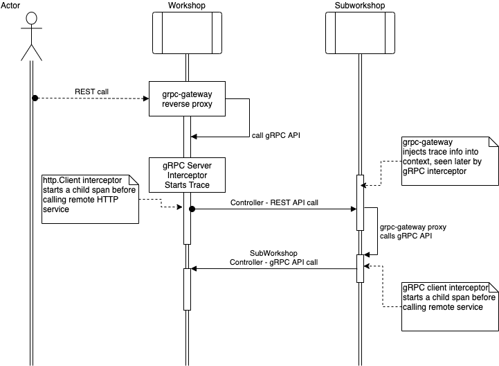

 

- [common/api](common/api) - protobuf API
- [common/mortar](common/mortar) - example of common library with pre-configured logger, tracing, metrics, etc
- [workshop](workshop) - Workshop service
- [subworkshop](subworkshop) - SubWorkshop service 

## How to run
`docker-compose up -d` - executed in root folder will start [Jaeger](https://www.jaegertracing.io)

`make run` - executed in workshop and subworkshop folders will start the services

## API usage example
```
## AcceptCar
curl -X "POST" "http://localhost:5381/v1/workshop/cars" \
  -H 'Content-Type: application/json; charset=utf-8' \
  -d $'{
"number": "ABCD4242",
"owner": "Mr. Smith",
"body_style": "SEDAN",
"color": "red"
}'

## PaintCar
curl -X "PUT" "http://localhost:5381/v1/workshop/cars/ABCD4242/paint" \
     -H 'Content-Type: application/json; charset=utf-8' \
     -d $'{
  "desired_color": "green"
}'

## RetrieveCar
curl "http://localhost:5381/v1/workshop/cars/ABCD4242"
```
After doing some requests you can see the traces [in local Jaeger](http://localhost:16686/search) if it was run

You can retrieve useful information from services, e.g.
```
## metrics
curl "http://localhost:5382/metrics"

## config
curl "http://localhost:5382/self/config"

## build
curl "http://localhost:5382/self/build"

## vars
curl "http://localhost:5382/internal/debug/vars"
```

## Some probably useful pictures
Fx DI in 10 seconds:


PaintCar workflow:
